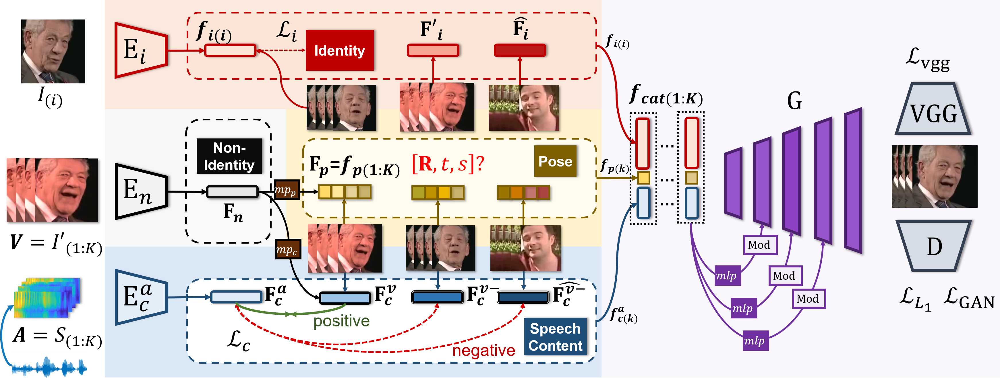

# PCAVS-Colab

# Pose-Controllable Talking Face Generation by Implicitly Modularized Audio-Visual Representation (CVPR 2021)

[Hang Zhou](https://hangz-nju-cuhk.github.io/), Yasheng Sun, [Wayne Wu](https://wywu.github.io/), [Chen Change Loy](http://personal.ie.cuhk.edu.hk/~ccloy/), [Xiaogang Wang](http://www.ee.cuhk.edu.hk/~xgwang/), and [Ziwei Liu](https://liuziwei7.github.io/).


### [Project](https://hangz-nju-cuhk.github.io/projects/PC-AVS) | [Paper](https://arxiv.org/abs/2104.11116) | [Demo](https://www.youtube.com/watch?v=lNQQHIggnUg)


We propose **Pose-Controllable Audio-Visual System (PC-AVS)**, 
which achieves free pose control when driving arbitrary talking faces with audios. Instead of learning pose motions from audios, we leverage another pose source video to compensate only for head motions.
The key is to devise an implicit low-dimension pose code that is free of mouth shape or identity information. 
In this way, audio-visual representations are modularized into spaces of three key factors: speech content, head pose, and identity information.




### Google Colab

**PCAVS-Colab**: <a href="https://colab.research.google.com/github/justinjohn0306/PCAVS-Colab/blob/main/PCAVS_Colab.ipynb" target="_parent"></a>


## License and Citation

The usage of this software is under [CC-BY-4.0](https://github.com/Hangz-nju-cuhk/Talking-Face_PC-AVS/LICENSE).
```
@InProceedings{zhou2021pose,
author = {Zhou, Hang and Sun, Yasheng and Wu, Wayne and Loy, Chen Change and Wang, Xiaogang and Liu, Ziwei},
title = {Pose-Controllable Talking Face Generation by Implicitly Modularized Audio-Visual Representation},
booktitle = {Proceedings of the IEEE Conference on Computer Vision and Pattern Recognition (CVPR)},
year = {2021}
}
```

## Acknowledgement
* The structure of this codebase is borrowed from [SPADE](https://github.com/NVlabs/SPADE).
* The generator is borrowed from [stylegan2-pytorch](https://github.com/rosinality/stylegan2-pytorch).
* The audio encoder is borrowed from [voxceleb_trainer](https://github.com/clovaai/voxceleb_trainer).
